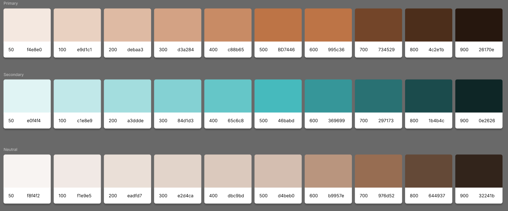

# 4.3.- Página Web **Mi Librería**
### HTML · CSS · Flexbox · Grid Layout  
**DAW – A**  
*(Aplicación del diseño realizado en Figma)*

---

## Uso de Inteligencias Artificiales

Al inicio del proyecto utilicé distintas inteligencias artificiales como:

- **Cursor**
- **ChatGPT**
- **Antigravity**

Sin embargo, los resultados no fueron satisfactorios, ya que **no se ajustaban correctamente al diseño realizado en Figma**.  
Los *prompts* enviados a estas IAs incluían:

- El **enlace de Figma**
- **Capturas de pantalla**
- Información adicional sobre el diseño

Cabe destacar que **el enlace de Figma solo funcionó correctamente en Antigravity**.

---

## IA Principal Utilizada: **Gemini Pro**

Finalmente, decidí trabajar con **Gemini Pro**, ya que fue la inteligencia artificial que:

- Menos problemas presentó
- Mejor se adaptó a la **originalidad del diseño de Figma**

Inicialmente le pasé el **enlace de Figma**, y parecía que lo interpretaba correctamente, pero más adelante comprobé que no era así.

### Solución aplicada

Ante este problema, opté por:

- Descargar las **imágenes de los mockups**
- Descargar la **imagen con la paleta de colores**
- Indicarle explícitamente cómo debía ser el diseño y qué colores utilizar

> 

---

## Proceso de Corrección y Ajustes

Tras la primera prueba:

- Algunas partes coincidían con Figma
- Otras presentaban errores o diferencias

Para solucionarlo:
- Fui indicando **pequeños defectos**
- Gemini Pro los iba corrigiendo progresivamente  
  *(por ejemplo, el diseño de las tarjetas)*

Además, hubo errores que corregí manualmente, como:
- Colores incorrectos
- Posición de imágenes
- Alineación de textos

---

## Resultado Final

Continué avanzando con **Gemini Pro** hasta finalizar el proyecto.  
Aunque en ocasiones proporcionaba contenido incompleto, como:

- La estructura de las tarjetas
- El fondo donde aparecen
- El orden y organización de los elementos

En general, la experiencia fue **muy positiva**, ya que me ayudó notablemente en distintos aspectos del desarrollo.

---

## Conclusión

Si tuviera que volver a elegir una inteligencia artificial para realizar un proyecto similar, **sin duda elegiría Gemini Pro**, ya que ha sido la más eficiente y la que mejor se ha adaptado al diseño original.
